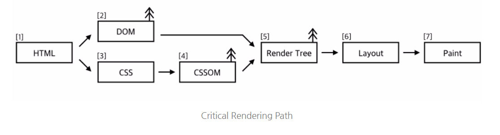

# CRP

<br />

## Critical Rendering Path

<br />

> 브라우저가 하나의 화면을 그려내는 과정을 의미한다. HTML 데이터를 우리가 실제 보는 화면으로 그려내기 까지 브라우저는 아래처럼 작업을 진행한다.



## Critical Rendering Path 최적화

<br />

CRP 최적화를 위해서는 먼저 HTML, CSS, JS 간의 종속성을 이해할 필요가 있습니다.  
브라우저의 초기 출력을 빠르게 하는 방법에 대해서 알아보겠습니다.

### CSS

<br />

CSS는 기본적으로 렌더링 차단 리소스입니다. CSS를 파싱하여 CSSOM이 생성되기 전까지는 브라우저는 스타일 시트를 렌더링하지 않습니다.  
렌더 트리를 통해 레이아웃과 페인팅을 하기 때문에, HTML과 CSS는 렌더링 차단 리소스입니다.  

> **미디어 유형, 미디어 쿼리의 사용**

페이지가 인쇄된다던가, 대형 모니터에 출력하는 경우와 같은 특수한 경우는 렌더링을 차단하지 않는 것이 좋습니다.  
특정 미디어 유형을 사용하면 `렌더링 비차단 리소스`로써 사용할 수 있습니다.

```html
<link href="style.css" rel="stylesheet"> <!--렌더링을 항상 차단합니다.-->
<link href="style.css" rel="stylesheet" media="all"> <!--렌더링을 항상 차단합니다.-->
<link href="print.css" rel="stylesheet" media="print"> <!--프린트 될 때만 적용되므로, 최초 로드시엔 차단되지 않습니다.-->
<link href="portrait.css" rel="stylesheet" media="orientation:landscape"> <!--기기 방향이 가로일때만 차단합니다.-->
<link href="other.css" rel="stylesheet" media="min-width: 40em"> <!--미디어 쿼리로 인해 너비가 일치하면 차단합니다.-->
```

렌더링 차단 리소스는 초기 렌더링을 보류할 뿐, `리소스 다운로드는 항상 일어납니다.`

### JavaScript

<br />

기본적으로 자바스크립트는 파서 차단 리소스입니다. 콘텐츠, 스타일, 인터렉션 등 모든 것을 다룰 수 있기 때문에 최악을 가정해 항상 렌더링을 막게 됩니다.  
최적화를 위해서는 자바스크립트를 비동기로 설정하고, CRP에서 불필요한 자바스크립트를 제거해야 합니다.  

> **JavaScript와 HTML의 종속성**

HTML 파서는 `script`태그를 만나면 DOM 생성을 멈추고, JS 엔진에 권한을 넘깁니다. 자바스크립트 실행이 완료된 후 브라우저가 중지했던 시점부터 DOM 생성을 다시 시작합니다.  
다만, script 태그가 `body` 태그 이전에 선언되었다면, 어떤 태그도 찾을 수 없습니다. 따라서, 자바스크립트는 모든 태그가 파싱된 후인 **body 태그를 닫기 직전에 선언하는 것이 유리합니다.**

> **JavaScript와 CSS의 종속성**

JavaScript는 CSSOM 속성도 읽고 수정할 수 있습니다.  
CSS를 파싱하는 도중 CSSOM과 JavaScript로 수정하는 과정에서 발생하는 CSSOM 수정 사이의 경재 조건이 발생할 수 있습니다. 결국에 브라우저는 이 문제 해결을 위해 CSSOM 생성 완료까지 DOM 생성과 JavaScript 생성을 멈춥니다.
이 종속성 때문에 브라우저에 화면을 띄울 때 상당한 지연이 발생할 수 있습니다.

> 비동기 JavaScript

```html
<scrript src="app.js" async></scrript>
```

스크립트가 페이지에 무엇을 수행할지 모르기 때문에 브라우저는 최악의 시나리오를 가정하고 파서를 차단합니다.
해당 스크립트가 바로 실행될 필요가 없다는 것을 알려준다면 브라우저는 지연없이 DOM을 생성해나갈 수 있습니다.
이 때 유리한 전략이 바로 `async` 속성을 추가한 **비동기 자바스크립트**입니다.


## 리소스 우선순위 지정

<br />

브라우저의 리소스 중에서 우선되는 리소스를 먼저 로드하게 된다는 특징이 있습니다. 이 추측이 항상 정답이 아니기 때문에 사용자가 직접 `preload`, `preconnect`, `prefetch`를 사용하여 우선순위를 전달하는 것이 가능합니다.
