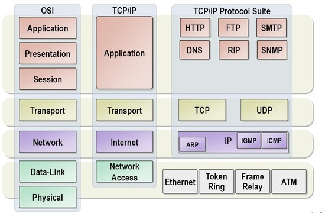

# TCP/UDP
 

OSI 7계층 중 전송 계층(Transport Layer)의 프로토콜.  

## Transport Layer VS Network Layer

> Transport Layer : Application 프로세스들 간의 논리적인 통신을 제공  
> Network Layer : host 간의 논리적인 통신을 제공

## TCP(Transmission Control Protocol)
 

**신뢰성**과 **단일 연결** 지향을 보장하는 프로토콜.  
일반적으로 IP와 함께 쓰이는데 IP는 직접적인 패킷의 배달을 TCP는 패킷의 추적 및 관리를 한다.  

* Transport 계층에서 패킷을 세그먼트라고 한다.
* UDP 프로토콜에서는 데이터그램이라고도 한다.

### TCP의 특징
* 3-way handshaking 과정을 통해 연결을 설정하고, 4-way handshaking 을 통해 해제한다.
* 흐름 제어와 혼잡 제어.
* 높은 신뢰성을 보장한다.
* UDP에 비해 속도가 느리다.

## UDP (User Datagram Protocol)
 

데이터를 데이터그램 단위로 처리하는 프로토콜.  
(**데이터 그램** | 독립적인 관계를 지니는 패킷)  

UDP는 각각의 패킷이 다른 경로로 전송되고 이 패킷은 독립적이다.  
서로 다른 경로로 처리되는 프로토콜을 UDP라고 한다.  

따라서 연결을 설정하고 해제하는 과정이 존재하지 않으며 패킷에 순서를 두기 때문에 흐름제어나 혼잡제어를 수행하지 않아 속도가 빠르다.
그러나 데이터 전송의 신뢰성이 낮아지는 문제도 있기 때문에 스트리밍 서비스 등에서 사용된다.

### UDP의 특징
* 비연결형 서비스로 데이터그램 방식을 제공한다.
* 정보를 주고 받을 때 정보를 보내거나 받는다는 신호 절차를 거치지 않는다.
* UDP 헤더의 CheckSum 필드를 통해 최소한의 오류만 검출한다.
* 신뢰성이 낮고 TCP보다 속도가 빠르다.