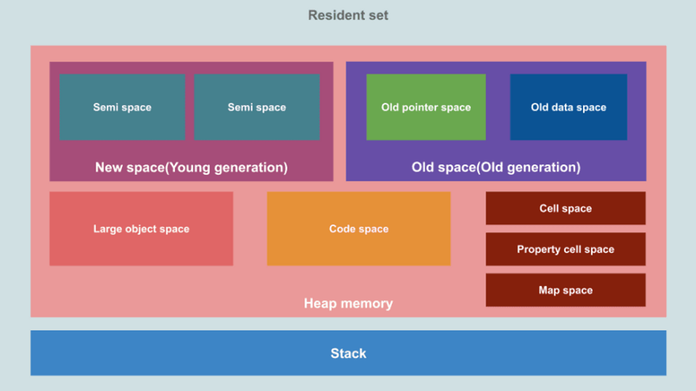

#Garbage Collection
 

쓸모 없어진 객체가 차지하는 메모리를 자동으로 해제하는 메모리 관리 시스템.
> **[장점]** 메모리 관리를 완벽히 안해도 가비지 콜렉션이 도와줌.  
> **[단점]** 가비지 콜렉션이 실행될 시기를 정할 수 없고, 처리에 자원이 많이 듦.

JavaScript에서는 값을 변경했을 때 새로운 메모리 공간에 값을 넣기 때문에 이전 값을 가비지 컬렉팅한다.
 

### 가비지 콜렉션 알고리즘 종류
* Reference-Counting 알고리즘
* Mark-and-Sweep 알고리즘
##Reference-Counting
 

> **[RECAP]** 객체를 참조하는 변수가 없을 때 가비지로 인식하고 메모리 공간을 해제.

~~~javascript
let x = {
  a: {
    b: 2
  }
}

let y = x;
x = 1;

let z = y.a.b;
y = 'foo';
// { x = 1; y = 'foo'; z = 2 }
// a: { b: 2 } <= 이거 없어짐..
~~~

객체 a를 참조하는 변수가 없기 때문에 가비지로 인식하고 메모리 공간을 해제.
* **순환 참조**  
두 개의 객체가 서로 참조하면 순환 구조가 생성되어 가비지가 인식되지 않는 경우가 있음.
 

## Mark-and-Sweep
 

> **[RECAP]** roots부터 탐색해서 접근 불가능한 객체를 가비지로 판단. 실행 컨텍스트 때문에 순환참조가 발생하지 않음.

* **White**: 아직 가비지 컬렉터가 탐색하지 못한 상태
* **Gray**: 가비지 컬렉터가 탐색했지만, 객체가 참조하는 객체들은 탐색하지 못한 상태
* **Black**: 가비지 컬렉터가 탐색했고, 참조하는 객체들도 탐색 완료한 상태

 

## V8 엔진 메모리 구조
 

V8 엔진에서 힙 메모리의 **New Space**와 **Old Space**에서 가비지 컬렉션이 일어난다.

* Minor GC: 스캐밴저가 관리하는 영역. New Space의 두 Semi Space로 나뉜다.
* Major GC: New Space에서 살아남은 객체들이 저장되는 공간. (두 번 이상 가비지 컬렉팅에서 해제되지 않은 객체)

###스캐밴저(Scavenger)
두 개의 메모리 공간(To space - From Space)로 가비지 컬렉션을 실행하는 방법.
> **[New Space]**
> >**[To space]** 객체를 1차로 저장하는 메모리 부분.  
> >**[From space]** To-Space가 다 찼을 때 스위칭하여 가비지 콜렉팅. 두 번 이상 살아남은 데이터들은 Old space로 보냄.

### Write Barriers
가비지 컬렉팅 과정에서 자료가 삭제되면서 생기는 문제 중에 하나는 Old space의 객체가 New space의 값을 참조하는 경우이다.  
이런 상황을 방지하기 위해서는 힙 메모리를 다 검사해야하는데, V8엔진에서는 Write Barriers를 만들어 전체 힙메모리를 검사하는 것을 막는다.

* Old space의 객체가 New space의 객체를 참조할 때, Stored buffer 공간에 New space 객체의 위치를 저장한다.
* Minor GC는 New space와 Stored buffer만 검사해도 객체들의 참조여부를 알 수 있다.
 