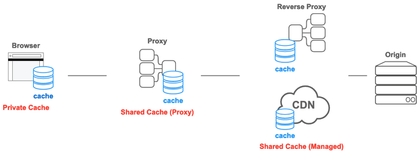

#HTTP 캐시

<br />

데이터 접근을 위해 네트워크를 사용해야하는 웹 환경에서 캐시는 유용하게 활용될 수 있다. HTTP 캐싱을 사용하면 웹사이트의 로딩 시간을 개선하는데 도움이 된다.  
  
특히 이미지 혹은 JS, CSS와 같은 파일들은 자주 변하지 않기 때문에 캐시를 사용하지 않으면 자주 변하지 않는 데이터도 요청마다 새로 다운로드를 하게 된다. 불필요한 네트워크 비용을 발생하게 되면 느린 웹페이지 로딩 속도로 직결되고, 좋지 않은 사용자 경험을 낳게 된다.

## HTTP Cache 종류

<br />



### Private Cache

웹 브라우저가 저장하는 캐시이다. 서버 응답에 `Authorization` 헤더가 포함되어 있다면 Private Cache에 저장되지 않는다.

### Shared Cache

웹 브라우저와 서버 사이에서 동작하는 캐시를 의미한다. 이 안에서도 `Proxy Cache`와 `Managed Cache` 두 가지로 나뉜다.  

**Proxy Cache** | (포워드) 프록시에서 동작하는 캐시이다.
**Managed Cache** | AWS Cloudfront 혹은 Cloudflare와 같은 CDN 서비스나 리버스 프록시에서 동작하는 캐시이다.


## 캐시 유효기간

<br />

HTTP에서 캐시를 지정하기 위해서 **Cache-Control**을 사용한다. 캐시 유효기간을 위해서는 max-age를 사용하여 최대 수명(초)을 설정할 수 있다.
만약 이 기간 내에 웹 브라우저가 같은 리소스에 요청을 보내면, 실제 웹서버에 요청을 보내지 않고 캐시에 저장된 사본 데이터를 사용자아게 제공한다.


## 캐시 유효성 검증 및 조건부 요청

<br />

캐시 유효기간이 지난 뒤에 요청을 보내도, 요청하는 데이터가 변경되지 않는 경우가 있다. 이런 낭비를 줄이기 위해서, 실제 원본 데이터가 수정되었을 때만 리소스를 내려받기 위해 **캐시 유효성 검증 및 조건부 요청**을 수행한다.  

### Last-Modified / If-Modified-Since

```http request

// 첫번째 요청 시 응답.
HTTP/1.1 200 OK
Content-Type: text/html
Cache-Control: max-age=3600
Last-Modified: Sat, 03 Sep 2022 00:00:00 GMT
Content-Length: 157

```

```http request
// 두번째 요청
GET /index.html HTTP/1.1
Host: example.com
Accept: text/html
If-Modified-Since: Sat, 03 Sep 2022 00:00:00 GMT
```

```http request
// 두번째 응답
HTTP/1.1 304 Not Modified
Content-Type: text/html
Cache-Control: max-age=3600
Last-Modified: Sat, 03 Sep 2022 00:00:00 GMT
```

첫 번째 요청 시 응답 헤더에 `Last-Modified` 속성이 들어 있고, 두 번째 요청 시에 `If-Modified-Since` 속성이 들어 있을 때 변경이 없다면, 위와 같이 `304 NOT MODIFIED`를 보낸다.

### ETag / If-None-Match

<br />

위의 `Last-Modified` 방법은 밀리초 단위의 수정사항이 있는 경우에는 판별할 수 없다. ETag는 현재 리소스에 대한 식별자(id 값)을 반환하여 관리한다.

```http request

// 첫번째 요청 시 응답.
HTTP/1.1 200 OK
Content-Type: text/html
Cache-Control: max-age=3600
ETag: "abcdefg"
Content-Length: 157

```

```http request
// 두번째 요청
GET /index.html HTTP/1.1
Host: example.com
Accept: text/html
If-None-Match: "abcdefg"
```

```http request
HTTP/1.1 304 Not Modified
Content-Type: text/html
Cache-Control: max-age=3600
Last-Modified: "abcdefg"
```


## no-cache, no-store

<br />

유저에게 최신 버전의 리소스를 제공하고 싶은 경우에는 해당 속성을 사용하면 유용하다.  
**Cache-Control 헤더는 요청과 응답 양쪽에서 모두 사용할 수 있다는 점을 유의하자.**

### no-cache

`no-cache`는 리소스에 대한 캐시는 생성하지만, 리소스를 요청할 때 항상 캐시 유효성 검증을 요청하는 옵션이다.

### no-store

`no-store`는 리소스에 대한 캐시를 생성하지 말라는 디렉티브이다. 저장하면 안되는 민감한 정보일 때 사용한다.
