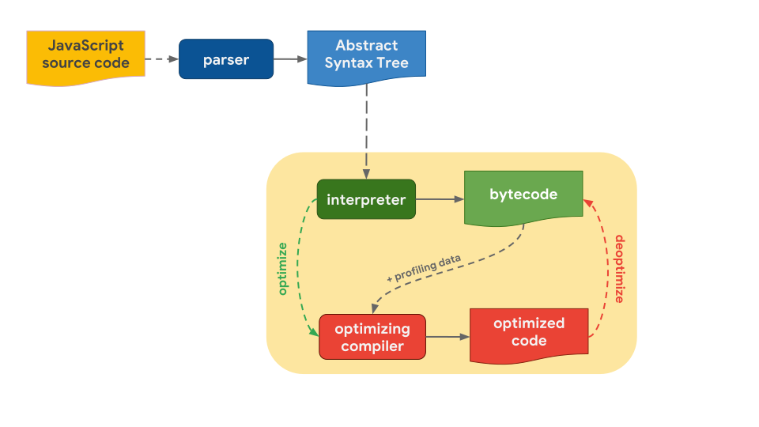

# 자바스크립트 엔진의 코드 실행

 

브라우저마다 엔진의 종류가 다르지만 코드를 실행하는 방식이 비슷하기 때문에 어떻게 실행하는지 알아두는 것이 좋다. (V8, SpiderMonkey, JavaScript core 등)  

* 소스코드를 만나면 파싱하여 **AST(Abstract Syntax Tree)** 로 변환한다.
* **인터프리터(Interpreter)** 는 AST를 기반으로 **바이트코드** 를 생성한다.
* 인터프리터가 바이트코드를 실행할 때, 자주 사용되는 함수 및 타입 정보 등이 있는 **프로파일링 데이터(Profiling data)** 와 같이 최적화 컴파일러에게 보낸다.
* 최적화 컴파일러가 최적화 코드를 생성한다.
* 프로파일링 데이터 중 잘못된 부분이 있다면 **최적화 해제(Deoptimize)** 를 하고 다시 바이트코드를 실행해서 이전 동작을 반복한다.