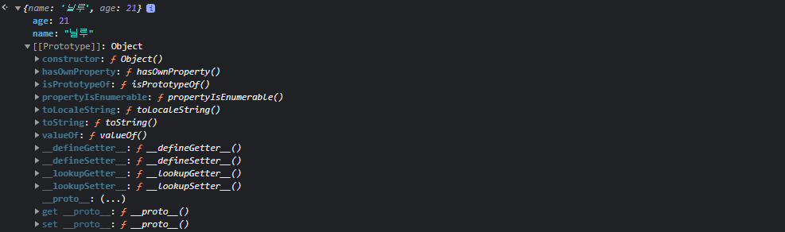
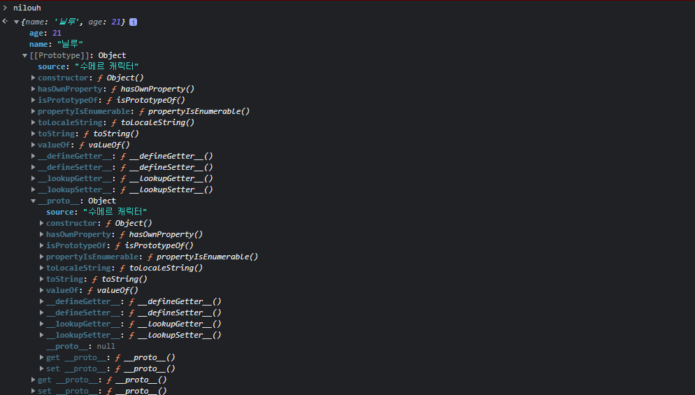

# Prototype

<br />

JavaScript에서는 `객체를 상속하기 위해서` 프로토타입이라는 방식을 사용한다.  
* 모든 객체들은 메소드와 속성을 상속받기 위한 템플릿으로써 프로토타입 객체를 가진다.
* 프로토타입 객체도 또 상위 프로토타입 객체로부터 메소드와 속성을 상속받을 수 있다.(프로토타입 체인)


## Prototype에 대한 직관적인 예시

<br />

```javascript
function Person(name, age) {
  this.name = name;
  this.age = age;
  return { name: this.name, age: this.age };
}
const nilouh = new Person("닐루", 21);
```



해당 객체의 Prototype에 값을 넣어준다면 어떻게 될까요?  
```javascript
nilouh.__proto__.source = "수메르 캐릭터";
```



재미있는건, `__proto__`의 `__proto__`가 있고, 그 안에도 source가 정의되었다는 점입니다.  
그런데, nilouh라는 객체의 프로토타입에 속성을 정의해서 넣어줬습니다.  
그렇다면 `Person.prototype`이나 `Object.prototype`의 결과는 어떨까요?  
따로 첨부하진 않지만 source에 우리가 입력한 값이 들어간 걸 확인할 수 있습니다.  
다만 이런 방법은 별로 좋은 방법은 아닙니다. 모든 객체가 수메르 캐릭터일리는 없으니까요.