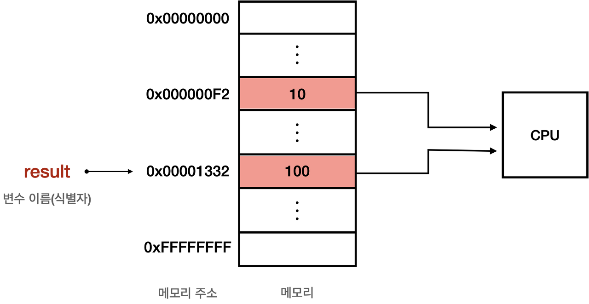

# 모던 자바스크립트

<br />

## 변수의 선언과 할당



### 1. 선언 단계

```javascript
console.log(score); // undefined

var score;
```
> 변수 이름을 **실행 컨텍스트**에 등록해서 자바스크립트 엔진에 변수의 존재를 알린다.

* 변수의 선언은 코드가 순차적으로 실행되기 이전에 소스코드 평가 과정에서 완료된다.
* JavaScript 엔진이 변수 선언을 포함해 모든 선언문을 찾아내 먼저 실행한다.
* 평가 과정이 끝나면, 비로소 모든 선언문을 제외하고 소스코드를 한 줄씩 순차적으로 실행한다.
* 선언문이 코드의 선두로 끌어올려진 것처럼 동작하는 것을 **변수 호이스팅**이라고 한다.

### 2. 초기화 단계

```javascript
var score = 100;
```
> 값을 저장하기 위한 메모리 공간을 확보하고, 암묵적으로 undefined를 할당해 초기화한다.

* 변수의 선언과 할당을 하나로 단축해도 소스 코드 평가 과정에서 변수 선언이 먼저 일어난다.
* 이어서 런타임 시점에서 값의 할당이 이루어진다.
* 값을 할당할 때에는, 기존의 undefined가 할당된 공간을 비우는게 아니라, 새로운 메모리 공간을 확보하고 그 곳에 새 값을 저장한다.
* 더 이상 메모리를 사용할 필요가 없으면 변수에 null을 할당해준다.

***

## Single thread와 Event Loop

<br />

JavaScript는 싱글 쓰레드 기반의 언어이다. 하지만 실제로 JS는 여러 개의 작업이 동시에 진행되는 것처럼 보인다.  
여러 개의 이벤트 리스너가 동작하고, 여러 개의 HTTP 요청을 수행하기도 한다.  
이는 **이벤트 루프(Event Loop)** 를 통해 이루어진다. 


### Single Thread VS Multi thread

<br />

> **싱글 쓰레드** | 하나의 작업이 끝나야 다음 작업 시작.  
> **멀티 쓰레드** | 두 개의 작업을 짧은 시간동안 번갈아 가면서 수행.

멀티 쓰레드가 더 빠를 것 같지만, 실제로는 **context switching**으로 인해 시간 전환에 리소스가 쓰이므로, 큰 차이가 없다.  
멀티 쓰레드는 CPU 이외의 자원을 사용하는 경우에 싱글 쓰레드보다 효율적이다.

### Event Loop

<br />

콜스택과 태스크 큐 사이를 왔다갔다하면서 콜스택이 비어있으면 태스크큐를 디큐해서 넣어준다.
> **[Call Stack]** <---(Event Loop)---> **[Task Queue]**  

```javascript
setTimeout(() => {
  console.log("안녕은");
}, 1000);

setTimeout(() => {
  console.log("영어로");
}, 1000);

setTimeout(() => {
  console.log("hi");
  console.log("TASK_QUEUE is being empty");
}, 1000);

console.log("all items are allocated in TASK_QUEUE");
```

위 함수의 동작을 자세히 살펴보자.
1. 먼저 순차적으로 setTimeout이 각각 call stack에 담긴다.
2. 콜백함수 내부의 로그는 task_queue에 할당된다.
3. 마지막 setTimeout이 끝나면 Task Queue의 첫 번째에 있던 콘솔이 call stack으로 옮겨진다.

모든 비동기 API들은 작업이 완료되면 콜백 함수를 태스크 큐에 추가하며, 이벤트 루프는 현재 실행중인 태스크가 없을 때 태스크 큐에서 dequeue하여 콜 스택에 push한다.